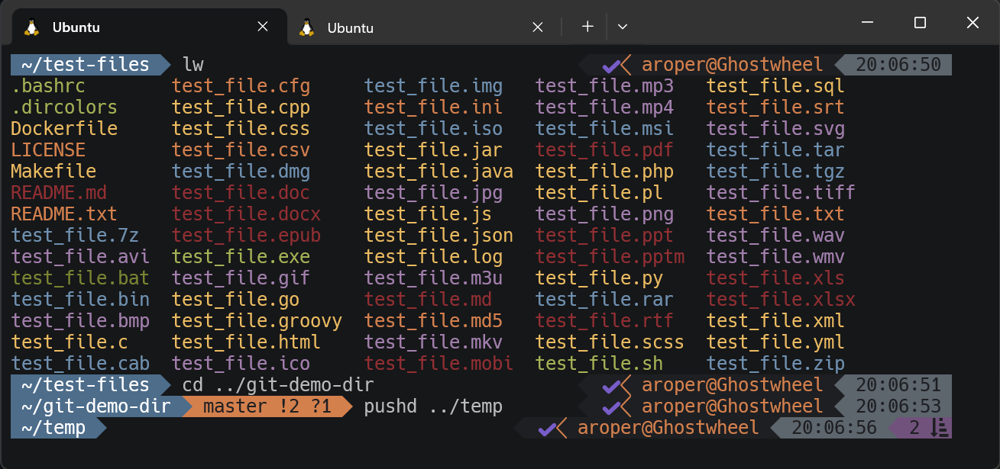

# roperdot: Cross-Platform Shell Configuration



## Design Philosophy

My goal for these dotfiles is to create a hybrid environment where your shell delivers enhanced functionality while also serving as a launcher for GUI applications. The install both configures your bash and/or zsh setup and installs shell and GUI applications.

### Key Features

**Cross-Platform**: I've tried to provide a consistent terminal experience across Windows (WSL/Ubuntu), MacOS, Ubuntu, and Linux Mint.

**Cross-Shell**: Aliases, functions and scripts in this dotfiles project have been written to work in either bash or zsh.  

**Shell-GUI Integration**: While working in your terminal you can launch GUI apps when needed (`e` for editing, `v` for viewing, `fm` for file manager). Files will be opened in an application based on the file type and the available software.

**Unified Color Schemes**: Consistent color theming is used for the prompt, `ls`, `diff`, `less` (using [Pygments](https://pygments.org/docs/cmdline/)), `man` pages, `git`, `git-blame-colored` (uses the Python [colored](https://pypi.org/project/colored/) library), `vim`, and many shell commands (using [generic colouriser](https://github.com/garabik/grc)).

**Enhanced Functionality**: Dozens of functions, aliases and scripts covering navigation, development, system administration, and file management. For details, see **[COMMAND_REFERENCE](docs/COMMAND_REFERENCE.md)**.

## Installation

```bash
cd
git clone https://github.com/andy-roper/roperdot
cd roperdot && ./install.sh
```

On MacOS to download without git:

```bash
cd && mkdir -p roperdot && curl -#L https://github.com/andy-roper/roperdot/tarball/main | tar -xzv --strip-components 1 -C roperdot
```

On Ubuntu to download without git:

```bash
cd && mkdir -p roperdot && wget -qO- https://github.com/andy-roper/roperdot/tarball/main | tar -xzv --strip-components 1 -C roperdot
```

Running install.sh will take you through an interactive installation in which you can select which configurations to apply and which apps to install.

On Windows, you should install [Chocolatey](https://chocolatey.org) first if you plan to install GUI applications with roperdot.

After installing, either source ~/.config/roperdot/roperdot-loader or restart your shell.

For more information about installation and configuration, see **[GETTING_STARTED](docs/GETTING_STARTED.md)**.

For details about the structure of this project, see [**ARCHITECTURE**](docs/ARCHITECTURE.md).

For information like advanced configuration, third-party applications used, history and future plans, see [**REFERENCE**](docs/REFERENCE.md).

## License

MIT License with some GPL v3 components. See **[LICENSE](LICENSE.md)** for details.

## Note on Contributions  

If anyone decides to use my dotfiles, I'm not currently accepting pull requests or issues at this time due to personal and work commitments. I plan to reopen contributions in a few months.

Feel free to fork for your own use in the meantime.

## Acknowledgments

These dotfiles use or integrate several fine open source tools. See [third-party applications](docs/REFERENCE.md#third-party-applications).

My bash prompt was based on that of [paulirish](https://github.com/paulirish/dotfiles).

Includes Visual Studio Code Plus schemes: https://github.com/vbasky/sublime-vscode-plus

